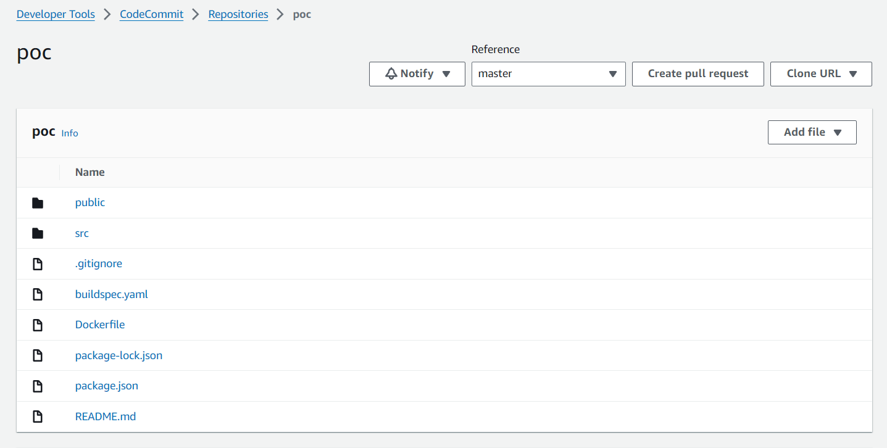

# End-to-End CI/CD Setup Documentation

This document outlines the setup for an end-to-end CI/CD (Continuous Integration/Continuous Deployment) pipeline using AWS services. The setup includes the creation of roles, pipelines, and associated resources to enable seamless deployment of code changes.

Creating CI/CD setup and deploying an sample java application using CFT templates.

Action item consists of below parameters:

- Sample java code
- buildspec.yaml 
- Dockerfile
- CFT templates
   - iam.yaml 
   - cicd-cft-template-v2.yaml

Upload the source code in AWS code commit:

Now create stack in AWS cloud formation template console:

stack name should be - "codepipeline-iam-stack"

Upload iam.yaml file first which will create roles for code build, code pipeline and cloud watch 

provide stack name, codeBucket, CodePipelineArtifactBucket and EcrDockerRepository as below:

Below resources are created:

Upload cicd-cft-template-v2.yaml

provide codecommit name, branch name, ecr repo name as per the requirement for creating the pipeline

Below resources are created:

simultaneously image has been pushed to ECR repo:

This document provides a comprehensive guide for setting up a CI/CD pipeline using AWS services. Follow the steps carefully to ensure a successful deployment and integration of your development workflow.
